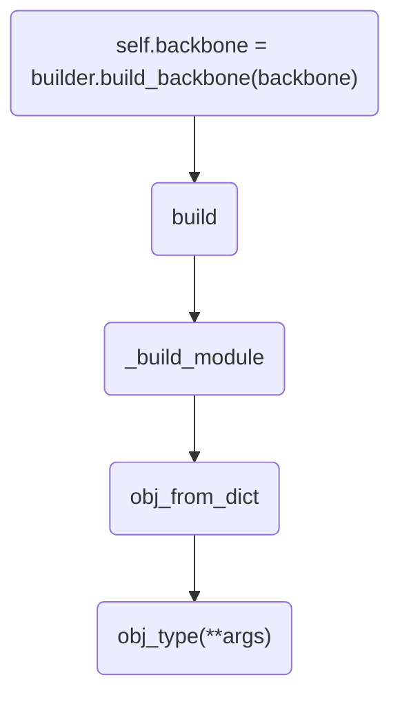

## 一、程序结构
上一篇博文中，我们分析了模型创建的过程，其最终返回的是一个FasterRCNN的类。类的初始化过程主要靠多个build函数，本文中，我们将逐个分析build函数。
```
self.backbone = builder.build_backbone(backbone)
```
backbone参数为：
```
{'type': 'ResNet', 'depth': 50, 'num_stages': 4, 'out_indices': (0, 1, 2, 3), 'frozen_stages': 1, 'style': 'pytorch'}
```
其返回的类为：
```
<class 'mmdet.models.backbones.resnet.ResNet'>
```
其函数调用逻辑如图：


可以看出其本质上仍然是基于build函数。我们以resnet为例，继续探究ResNet类的结构。
在开始分析resnet结构之前，我们先学习几个基础模块，

上图左边的结构为BasicBlock，resnet18和resnet34一般使用这一结构。右边的结构为Bottleneck，resnet50,101,134使用这种结构。
以resnet18为例，其结构如下图所示：


## 二、核心代码
### 1. 3×3卷积定义
resnet中大量使用3×3卷积，代码中定义了conv3x3函数
```
def conv3x3(in_planes, out_planes, stride=1, dilation=1):
    "3x3 convolution with padding"
    return nn.Conv2d(
        in_planes,
        out_planes,
        kernel_size=3,
        stride=stride,
        padding=dilation,
        dilation=dilation,
        bias=False)
```

### 2. BasicBlock
代码逻辑十分简单，自己看吧:-).

### 3. Bottleneck
此处有几点需要注意, conv3中有一个通道数增加的过程，如下：
```
self.conv3 = nn.Conv2d(
    planes, planes * self.expansion, kernel_size=1, bias=False)
self.bn3 = nn.BatchNorm2d(planes * self.expansion)
```
通过此步骤之后，通道数增加４倍。
另一个需要注意的地方是第一次卷积的时候，有一个隐含的通道数变化，通道数减少为1/4
```
self.conv1 = nn.Conv2d(
    inplanes,  #256
    planes,    #64
    kernel_size=1,
    stride=self.conv1_stride,
    bias=False)

```
inplanes--->256
places--->64
剩下代码搭积木即可。
### 4. Resnet class
resnet class 有四部分的内容，分别是init, init_weight, forward, train_cfg
#### init
网络结构的基本定义，基本就是一些卷积，BN之类的，对照网络结构慢慢看就行了。需要注意的是res_layer的生成，其实也不算难，代码贴上即可：
```
for i, num_blocks in enumerate(self.stage_blocks):
    stride = strides[i]
    dilation = dilations[i]
    planes = 64 * 2**i
    res_layer = make_res_layer(
        self.block,
        self.inplanes,
        planes,
        num_blocks,
        stride=stride,
        dilation=dilation,
        style=self.style,
        with_cp=with_cp)
    self.inplanes = planes * self.block.expansion
    layer_name = 'layer{}'.format(i + 1)
    self.add_module(layer_name, res_layer)
    self.res_layers.append(layer_name)
```
#### init_weight
参数的初始化，主要是是否从pretrain中restore的问题，问题应该不大，略了。
#### forward
按照结构搭积木
#### train
关于BN和frozen_stage的设置，所有训练和测试会有不同设置的代码，感觉都可以扔到这个部分。
