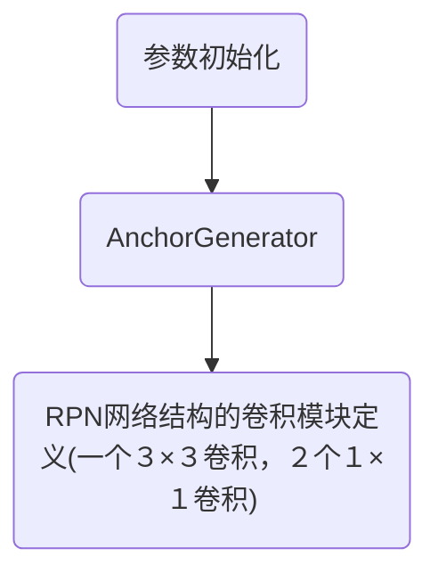

## 一、模型概览
类：
```
<class 'mmdet.models.rpn_heads.rpn_head.RPNHead'>
```
参数：
```
{'in_channels': 256, 'feat_channels': 256, 'anchor_scales': [8], 'anchor_ratios': [0.5, 1.0, 2.0], 'anchor_strides': [4, 8, 16, 32, 64], 'target_means': [0.0, 0.0, 0.0, 0.0], 'target_stds': [1.0, 1.0, 1.0, 1.0], 'use_sigmoid_cls': True}
```
## 二、初始化流程

### 初始化函数
```
def __init__(self,
             in_channels,
             feat_channels=256,
             anchor_scales=[8, 16, 32],
             anchor_ratios=[0.5, 1.0, 2.0],
             anchor_strides=[4, 8, 16, 32, 64],
             anchor_base_sizes=None,
             target_means=(.0, .0, .0, .0),
             target_stds=(1.0, 1.0, 1.0, 1.0),
             use_sigmoid_cls=False):
```

参数介绍：
```

                                  / - rpn_cls (1x1 conv)
    input - rpn_conv (3x3 conv) -
                                  \ - rpn_reg (1x1 conv)

    Args:
        in_channels (int): Number of channels in the input feature map.
        feat_channels (int): Number of channels for the RPN feature map.
        anchor_scales (Iterable): Anchor scales.
        anchor_ratios (Iterable): Anchor aspect ratios.
        anchor_strides (Iterable): Anchor strides.
        anchor_base_sizes (Iterable): Anchor base sizes.
        target_means (Iterable): Mean values of regression targets.
        target_stds (Iterable): Std values of regression targets.
        use_sigmoid_cls (bool): Whether to use sigmoid loss for classification.
            (softmax by default) 请注意这一条，和原论文略有不同。

```
初始化流程

注意：AnchorGenerator的内容是一个类，后续会有详细的介绍。

前向传播
```
def forward_single(self, x):
        rpn_feat = self.relu(self.rpn_conv(x))
        rpn_cls_score = self.rpn_cls(rpn_feat)
        rpn_bbox_pred = self.rpn_reg(rpn_feat)
        return rpn_cls_score, rpn_bbox_pred

    def forward(self, feats):
        return multi_apply(self.forward_single, feats)
```
