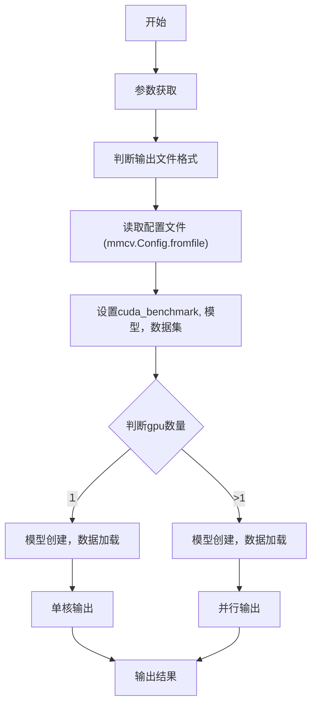

## 一、程序结构
test.py的代码结构比较简单，如下流程图所示：



## 核心代码梳理
### (1)参数获取
```
args = parse_args()

```
主要解析参数，其参数含义为：
| 参数名 | 含义 |
| ------ | ------ |
| config | 配置文件名 |
| checkpoint | checkpoint 文件 |
| gpus | gpu数量 |
| proc_per_gpu | 每个GPU的进程数, 默认为１　|
| out | 输出文件名 |
| eval | 验证类型 |
| show | 显示结果 |

### (2)配置文件解析
```
cfg = mmcv.Config.fromfile(args.config)
```
后续有具体博文

### (3)数据集加载
```
dataset = obj_from_dict(cfg.data.test, datasets, dict(test_mode=True))
```
后续

### (4)模型创建及数据加载
单卡
```
model = build_detector(
            cfg.model, train_cfg=None, test_cfg=cfg.test_cfg)
        load_checkpoint(model, args.checkpoint)
        model = MMDataParallel(model, device_ids=[0])

        data_loader = build_dataloader(
            dataset,
            imgs_per_gpu=1,
            workers_per_gpu=cfg.data.workers_per_gpu,
            num_gpus=1,
            dist=False,
            shuffle=False)
        outputs = single_test(model, data_loader, args.show)
```
多卡
```
model_args = cfg.model.copy()
       model_args.update(train_cfg=None, test_cfg=cfg.test_cfg)
       model_type = getattr(detectors, model_args.pop('type'))
       outputs = parallel_test(
           model_type,
           model_args,
           args.checkpoint,
           dataset,
           _data_func,
           range(args.gpus),
           workers_per_gpu=args.proc_per_gpu)
```
后续
