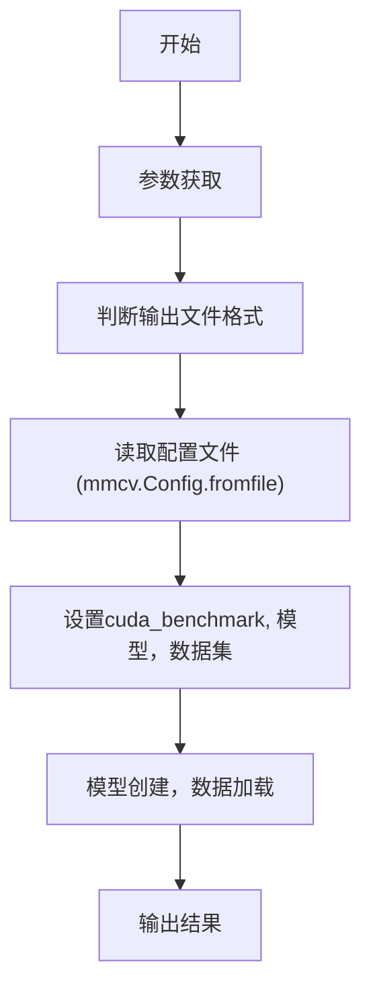

## 一、程序结构
test.py的代码结构比较简单，如下流程图所示：



## 二、核心代码梳理
### (1)参数获取
```
args = parse_args()

```
主要解析参数，其参数含义为：
| 参数名 | 含义 |
| ------ | ------ |
| config | 配置文件名 |
| work_dir | 保存log和model的目录 |
| resume_from | checkpoint 文件 |
| validate | 训练的时候是否做验证|
| gpus | gpu数量 |
| seed | 随机数种子 |
| launcher | job launcher |
| local_rank | 暂时不清楚　|
### (2)配置文件解析
```
cfg = mmcv.Config.fromfile(args.config)
```
后续有具体博文

### (3)数据集加载
```
dataset = obj_from_dict(cfg.data.test, datasets, dict(test_mode=True))
```
后续

### (4)模型创建及数据加载
```
train_dataset = get_dataset(cfg.data.train)
    train_detector(
        model,
        train_dataset,
        cfg,
        distributed=distributed,
        validate=args.validate,
        logger=logger)

```
