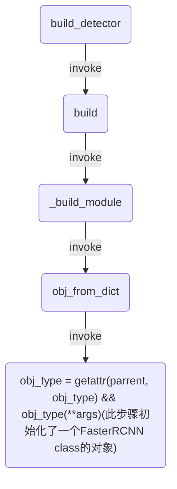
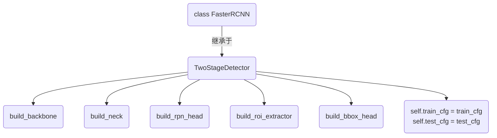

## 一、程序结构
本文主要介绍mmdetection中的模型构建过程。在train.py中，其相关函数是
```
model = build_detector(
        cfg.model, train_cfg=cfg.train_cfg, test_cfg=cfg.test_cfg)
```
三个参数分别是model的配置文件，训练的配置文件和测试的配置文件。以faster_rcnn_r50_fpn_1x.py为例，解析后三个参数如下：
cfg.model:
```
{'type': 'FasterRCNN', 'pretrained': 'modelzoo://resnet50', 'backbone': {'type': 'ResNet', 'depth': 50, 'num_stages': 4, 'out_indices': (0, 1, 2, 3), 'frozen_stages': 1, 'style': 'pytorch'}, 'neck': {'type': 'FPN', 'in_channels': [256, 512, 1024, 2048], 'out_channels': 256, 'num_outs': 5}, 'rpn_head': {'type': 'RPNHead', 'in_channels': 256, 'feat_channels': 256, 'anchor_scales': [8], 'anchor_ratios': [0.5, 1.0, 2.0], 'anchor_strides': [4, 8, 16, 32, 64], 'target_means': [0.0, 0.0, 0.0, 0.0], 'target_stds': [1.0, 1.0, 1.0, 1.0], 'use_sigmoid_cls': True}, 'bbox_roi_extractor': {'type': 'SingleRoIExtractor', 'roi_layer': {'type': 'RoIAlign', 'out_size': 7, 'sample_num': 2}, 'out_channels': 256, 'featmap_strides': [4, 8, 16, 32]}, 'bbox_head': {'type': 'SharedFCBBoxHead', 'num_fcs': 2, 'in_channels': 256, 'fc_out_channels': 1024, 'roi_feat_size': 7, 'num_classes': 81, 'target_means': [0.0, 0.0, 0.0, 0.0], 'target_stds': [0.1, 0.1, 0.2, 0.2], 'reg_class_agnostic': False}}
```
train_cfg:
```
{'rpn': {'assigner': {'type': 'MaxIoUAssigner', 'pos_iou_thr': 0.7, 'neg_iou_thr': 0.3, 'min_pos_iou': 0.3, 'ignore_iof_thr': -1}, 'sampler': {'type': 'RandomSampler', 'num': 256, 'pos_fraction': 0.5, 'neg_pos_ub': -1, 'add_gt_as_proposals': False}, 'allowed_border': 0, 'pos_weight': -1, 'smoothl1_beta': 0.1111111111111111, 'debug': False}, 'rcnn': {'assigner': {'type': 'MaxIoUAssigner', 'pos_iou_thr': 0.5, 'neg_iou_thr': 0.5, 'min_pos_iou': 0.5, 'ignore_iof_thr': -1}, 'sampler': {'type': 'RandomSampler', 'num': 512, 'pos_fraction': 0.25, 'neg_pos_ub': -1, 'add_gt_as_proposals': True}, 'pos_weight': -1, 'debug': False}}
```
test_cfg:
```
{'rpn': {'nms_across_levels': False, 'nms_pre': 2000, 'nms_post': 2000, 'max_num': 2000, 'nms_thr': 0.7, 'min_bbox_size': 0}, 'rcnn': {'score_thr': 0.05, 'nms': {'type': 'nms', 'iou_thr': 0.5}, 'max_per_img': 100}}
```
其函数调用结构如下图所示：

Faster RCNN的初始化过程如下图所示

对于上图的build过程，同FasterRCNN一致，后续将有详解。

## 代码梳理：
一
```
model = build_detector(
        cfg.model, train_cfg=cfg.train_cfg, test_cfg=cfg.test_cfg)

def build_detector(cfg, train_cfg=None, test_cfg=None):
    from . import detectors
    return build(cfg, detectors, dict(train_cfg=train_cfg, test_cfg=test_cfg))
```
model所需参数
二
```
def build(cfg, parrent=None, default_args=None):
    if isinstance(cfg, list):
        modules = [_build_module(cfg_, parrent, default_args) for cfg_ in cfg]
        return nn.Sequential(*modules)
    else:
        return _build_module(cfg, parrent, default_args)
```
根据是否为list分别调用_build_module
三
```
def _build_module(cfg, parrent=None, default_args=None):
    print("4")
    return cfg if isinstance(cfg, nn.Module) else obj_from_dict(
        cfg, parrent, default_args)
```
根据参数在obj_from_dict中创建一个object
四
```
def obj_from_dict(info, parrent=None, default_args=None):
    """Initialize an object from dict.

    The dict must contain the key "type", which indicates the object type, it
    can be either a string or type, such as "list" or ``list``. Remaining
    fields are treated as the arguments for constructing the object.

    Args:
        info (dict): Object types and arguments.
        module (:class:`module`): Module which may containing expected object
            classes.
        default_args (dict, optional): Default arguments for initializing the
            object.

    Returns:
        any type: Object built from the dict.
    """
    assert isinstance(info, dict) and 'type' in info
    assert isinstance(default_args, dict) or default_args is None
    args = info.copy()
    obj_type = args.pop('type')
    if mmcv.is_str(obj_type):
        if parrent is not None:
            obj_type = getattr(parrent, obj_type)
        else:
            obj_type = sys.modules[obj_type]
    elif not isinstance(obj_type, type):
        raise TypeError('type must be a str or valid type, but got {}'.format(
            type(obj_type)))
    if default_args is not None:
        for name, value in default_args.items():
            args.setdefault(name, value)
    return obj_type(**args)

```
创建对象的核心实现，getattr从detectors中找出obj_type的类定义，然后使用剩下的参数初始化。
