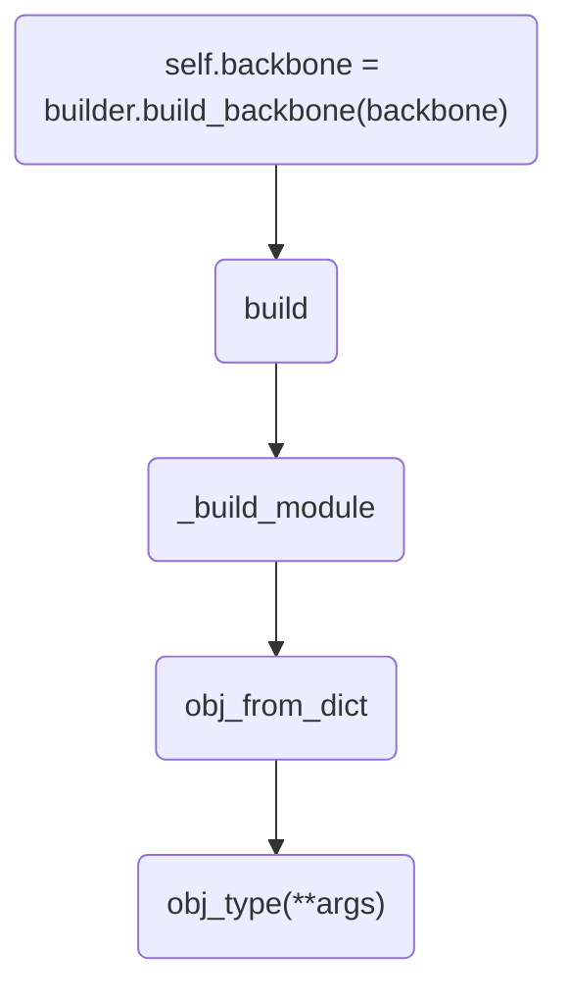

## 一、程序结构
上一篇博文中，我们分析了模型创建的过程，其最终返回的是一个FasterRCNN的类。类的初始化过程主要靠多个build函数，本文中，我们将逐个分析build函数。
```
self.backbone = builder.build_backbone(backbone)
```
backbone参数为：
```
{'type': 'ResNet', 'depth': 50, 'num_stages': 4, 'out_indices': (0, 1, 2, 3), 'frozen_stages': 1, 'style': 'pytorch'}
```
其返回的类为：
```
<class 'mmdet.models.backbones.resnet.ResNet'>
```
其函数调用逻辑如图：


可以看出其本质上仍然是基于build函数，关于各模块的具体创建过程，将在后续博文中做详细介绍

## 二、核心代码
本节代码较为简单，解析略。
